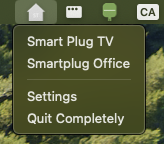

# Home Assistant Simple Tray

A lightweight system tray application for macOS (Windows support coming soon) that provides quick access to toggle Home Assistant switches directly from your menu bar.




## Features

- 🎯 **Quick Access**: Toggle Home Assistant switches directly from your system tray
- 🔒 **Secure**: Connects to your Home Assistant instance using your personal access token
- 🎨 **Native Look**: Seamlessly integrates with your macOS menu bar
- ⚡ **Fast & Lightweight**: Built with Tauri for minimal resource usage
- 🔄 **Real-time Updates**: Automatically syncs with your Home Assistant instance
- 📱 **Platform Support**: Currently supports macOS, with Windows support planned


## Installation

### Pre-built Releases

Download the latest release for your platform from the [Releases](https://github.com/dsegovia90/homeassistant-simple-tray/releases) page.

- **macOS**: Download the `.dmg` file and drag the application to your Applications folder
- **Windows**: (Coming soon)

### From Source

#### Prerequisites

- macOS (for now)
- Home Assistant instance with accessible API
- Home Assistant Long-Lived Access Token
- Deno v2.x
- Rust (latest stable)

1. Clone the repository:
```bash
git clone https://github.com/dsegovia90/homeassistant-simple-tray.git
cd homeassistant-simple-tray
```

2. Install dependencies:
```bash
deno install
```

3. Build the application:
```bash
deno run tauri build
```

4. The built application will be available in `src-tauri/target/release/bundle/`

## Configuration

1. Launch the application - it will appear in your system tray
2. Click on the tray icon and select "Settings"
3. Enter your Home Assistant configuration:
   - **URL**: Your Home Assistant instance URL (e.g., `http://homeassistant.local:8123` or `https://your-domain.com`)
   - **Access Token**: Your Long-Lived Access Token from Home Assistant

### Getting a Home Assistant Access Token

1. Log in to your Home Assistant instance
2. Click on your profile (bottom left)
3. Select the Security tab
4. Scroll down to "Long-Lived Access Tokens"
5. Click "Create Token"
6. Give it a name (e.g., "Simple Tray")
7. Copy the token and save it securely

## Usage

- **Toggle Switches**: Click the tray icon to see all your available switches. Click any switch to toggle it on/off
- **Refresh**: The switch states update automatically, but you can force a refresh from the menu
- **Settings**: Access settings to update your Home Assistant connection details, and change the selectable switches
- **Quit**: Right-click the tray icon or use the menu option to quit the application

## Development

### Setup Development Environment

1. Clone and install dependencies:
```bash
git clone https://github.com/dsegovia90/homeassistant-simple-tray.git
cd homeassistant-simple-tray
npm install
```

2. Run in development mode:
```bash
npm run tauri dev
```

### Project Structure

```
homeassistant-simple-tray/
├── src/                    # Vue frontend source
├── src-tauri/             # Rust backend source
│   ├── src/
│   │   ├── api_settings.rs    # API configuration handling
│   │   ├── home_assistant.rs  # Home Assistant API client
│   │   ├── tray.rs           # System tray management
│   │   └── lib.rs            # Main application logic
│   └── Cargo.toml         # Rust dependencies
├── package.json           # Node.js dependencies
└── README.md             # This file
```

### Technologies Used

- **[Tauri](https://tauri.app/)**: Framework for building native desktop apps
- **[Vue 3](https://vuejs.org/)**: Frontend framework with Composition API
- **[TypeScript](https://www.typescriptlang.org/)**: Type-safe JavaScript
- **[Tailwind CSS](https://tailwindcss.com/)**: Utility-first CSS framework
- **[Rust](https://www.rust-lang.org/)**: System programming language for the backend

## Troubleshooting

### Application doesn't appear in system tray
- Make sure you've granted the necessary permissions in System Preferences
- Try restarting the application

### Cannot connect to Home Assistant
- Verify your Home Assistant URL is correct and accessible
- Check that your access token is valid and has the necessary permissions
- Ensure your firewall isn't blocking the connection

### Switches not updating
- Check your network connection
- Verify the Home Assistant API is accessible
- Try refreshing from the menu

## Contributing

Contributions are welcome! Please feel free to submit a Pull Request. For major changes, please open an issue first to discuss what you would like to change.

1. Fork the repository
2. Create your feature branch (`git checkout -b feature/amazing-feature`)
3. Commit your changes (`git commit -m 'Add some amazing feature'`)
4. Push to the branch (`git push origin feature/amazing-feature`)
5. Open a Pull Request

## Roadmap

- [ ] Display switch states (on/off)
- [ ] Windows support
- [ ] Linux support
- [ ] Support for other Home Assistant entities (lights, sensors, etc.)
- [ ] Customizable keyboard shortcuts
- [ ] Entity grouping and favorites
- [ ] Dark/Light mode support
- [ ] Auto-start on system boot option
- [ ] Multiple Home Assistant instance support

## License

This project is licensed under the MIT License - see the [LICENSE](LICENSE) file for details.

## Support

If you find this project helpful, please consider:
- ⭐ Starring the repository
- 🐛 Reporting bugs and suggesting features
- 💻 Contributing to the codebase
- 📣 Sharing with others who might find it useful

---

Made with ❤️ by [dsegovia90](https://github.com/dsegovia90)
